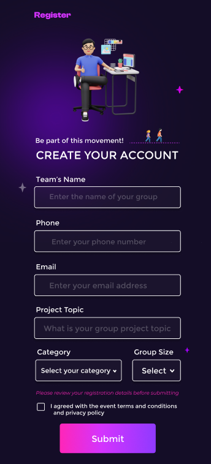
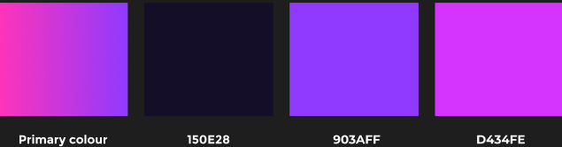

# React Website Template

Welcome to the React Website Template project! This template is a modern starting point for React applications, using Vite for fast builds and TailwindCSS for utility-first styling. Whether you're building a personal project or a professional web application, this template will get you up and running quickly.

## Project Brief

This template provides a clean and flexible starting point for React projects. It includes:

- **React** for building user interfaces.
- **Vite** for fast and efficient development builds.
- **TailwindCSS** for easy and responsive styling.

Feel free to customize and extend it according to your project's needs.

## Features

- Fast development environment with Vite
- Scalable and maintainable styling with TailwindCSS
- Responsive design out of the box
- Basic example components and pages to get started

## Demo

Here are some images and a video showcasing the demo of this template:

_Web view of the Register page_

_Mobile view of the Register page_

<!-- 
_Watch a quick demo video on YouTube_ -->

## Color codes

## Project Structure

The project structure is as follows:

- `public/`: Contains static image assets.
- `src/`: Contains all the source code.
  - `components/`: All React components.
    - `pages/`: React components for different pages.
    - `partials/`: Reusable React components for different pages.
- `index.html`: The main HTML file.
- `vite.config.js`: Vite configuration file.
- `tailwind.config.js`: TailwindCSS configuration file.
- `package.json`: The project's package.json file.
- `README.md`: The project's README.md file.

Happy coding!
